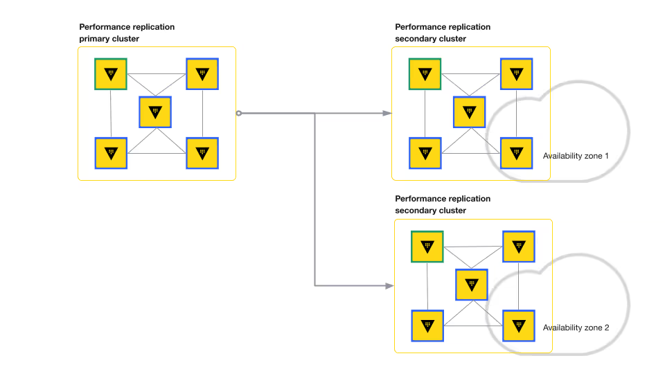

# Vault
### Overall
- A complete security lifecycle management system
- Using to store, manage, and retrieve secretes, generate on-demand credentials to common platforms such as AWS, GCP, K8s, Microsoft Azure
- Manage common Private Key Infrastructure (PKI) workflow
- Encrypt and transit data for application

## Scnenario
- Encrypt all customer data in transit and at rest.
- Restrict access to cloud environments to only those people or services that require access to operate the business.
- Time box access to the cloud environments.
- Allow teams to securely store API keys, passwords, certificates, etc.
- Any new solution must have disaster recovery support.
- Ability to scale any new solutions to meet increase business demand.
- Not isolated to any specific cloud service provider.

## Technical Challenge 
### Data encryption

#### 🔐 Encryption with Vault Secrets Engines

The platform team uses Vault's secrets engines to ensure that all customer data is encrypted, both at rest and in transit.

#### 🗄️ Data at Rest
- The **versioned key/value (kv) secrets engine** stores data as encrypted key-value pairs.
- It supports **multiple versions**, allowing rollback in case of accidental changes or deletions.
- It includes **Check-and-Set (CAS)** to prevent unintended overwrites.

#### 📡 Data in Transit
- The **transit secrets engine** provides **encryption as a service**.
- It performs **cryptographic operations** on data without storing it, ensuring secure transmission.

### Access control

#### 🛡️ Access Control in Vault

Vault offers a comprehensive set of access control features to ensure that only authorized people or services can access cloud environments.

- **ACL Policies**: Use declarative rules to allow or deny access to specific paths and operations within Vault.
- **Control Groups**: Require additional authorization from one or more third parties before a request is approved.
- **Sentinel Policies**: Enable advanced logic for access control, such as time of day or source IP. These include:
  - **Role Governing Policies (RGP)**: Attached to tokens, identities, or groups.
  - **Endpoint Governing Policies (EGP)**: Attached to specific paths.

In addition to these policy types, Vault can generate **dynamic credentials**, eliminating the need for long-lived static credentials and enhancing overall security.

### Time boxed access

#### ⏱ Time-Bound Access with TTL in Vault

Vault supports applying **Time-To-Live (TTL)** values to **tokens** and **leases**, enforcing time-boxed access to resources. This is a best practice for minimizing the risk of long-lived credentials.

#### 🔐 Token TTL
- When a user authenticates using the **username/password** method with a defined **role**, Vault issues a **token** with an associated TTL.
- If the TTL expires and renewal is not possible or skipped, Vault **automatically revokes** the token.

#### 🧩 Dynamic Secret TTL
- When using secrets engines like the **database secrets engine**, dynamic secrets are issued with TTL values set at the **role level**.
- Vault **automatically revokes** these secrets once the TTL expires.

TTL values can be defined at:
- The **server level**
- The **plugin level**
- The **role level**

This flexible TTL system ensures credentials are short-lived and access remains tightly controlled.

### Disaster recovery support

#### 🌐 Disaster Recovery in Vault Enterprise

#### 🧩 Disaster Recovery Replication
- A **primary Vault cluster** can replicate its data to **secondary clusters**.
- **Secondary clusters** act as warm standby nodes and do not serve read/write requests until promoted to primary.
- Ensures business continuity by enabling failover with minimal downtime.

#### 🗂️ Automated Snapshots
- Vault supports **automated integrated storage snapshots**, allowing operators to schedule and manage multiple independent data snapshots.
- Snapshots can be stored **locally** or in **cloud storage providers**.
- Enhances data protection and simplifies recovery workflows.

#### ⚙️ Integrated Storage Autopilot
- The **Autopilot** feature automates cluster maintenance tasks for integrated storage:
  - Performs **node health checks**
  - Stabilizes newly-added or unstable nodes
  - **Cleans up failed nodes** automatically
- Reduces manual overhead and ensures smoother cluster operations.

### Performance scaling

#### 🏗️ Vault Node Roles: Active vs. Performance Standby

Vault supports a high-availability (HA) architecture with specialized node roles to balance scalability and consistency.

#### 🟢 Active Node
- Handles **all requests that mutate storage**, including:
  - Writing secrets
  - Updating configurations
  - Revoking credentials

#### 🟡 Performance Standby Nodes
- Handle **read-only and non-mutating requests**, such as:
  - `GET` operations for key/value secrets
  - **Transit Secrets Engine** encryption and decryption
- Improve **horizontal scalability** by offloading read traffic from the active node.
- Do **not** serve write requests or participate in Raft consensus for changes.

This separation of responsibilities ensures both **scalability** and **data integrity** within a single Vault cluster.

Vault supports **Performance Replication** to enable **data availability** and **horizontal scalability** across multiple geographic regions.

#### 🔑 Primary Node
- The **Primary node** replicates its configuration to several **secondary clusters** across different regions.
- Supports **scalable, highly available use cases**, allowing Vault to meet the growing needs of clients and teams.

#### 🌐 Secondary Clusters
- **Secondary clusters** mirror the configuration of the primary node but do **not** replicate Vault authentication tokens and leases.
- They can handle client requests, providing **data locality** and improved performance for applications in different regions.
- Operators can enforce a **common set of access control policies** and provide **consistent secrets** to applications that need to interoperate globally.

Performance replication ensures that Vault can scale effectively across regions while maintaining **global policy enforcement** and **consistent secrets** across the infrastructure.

### Identity-based security

Vault uses **Identity** to recognize clients and automate access to secrets. Through entities and aliases, Vault can tie authentication to policies and tokens, helping manage client access in a seamless manner.

#### 🔑 Vault Identity System
- Vault provides an **identity management solution** via the **Identity Secrets Engine**.
- **Entities** represent consolidated identities of users, applications, or machines.
  - Each entity can have multiple **aliases**, which are linked to authentication methods and identity providers.
  
#### 🔄 Integration with Authentication Providers
- Vault supports integration with **multiple identity providers** for authentication, enabling users to authenticate through various methods.
- Authentications from different sources can be mapped to a single **entity**, ensuring consistent identity across different systems.

This approach allows Vault to centralize and automate access management, providing a flexible way to manage secrets and policies for diverse clients.

### Secrets sprawl

  
  

#### 🚫 Secrets Sprawl: The Anti-Pattern

A common anti-pattern in secrets management is **secrets sprawl**, where secrets are scattered across various systems, each with its own identity and authentication mechanisms.

#### 🛑 The Problem
- **Secrets Sprawl** leads to reduced **operational efficiency**.
- It increases **maintenance overhead** as teams must manage multiple systems and authentication mechanisms.

#### 🔒 Vault's Solution
- Vault helps eliminate secrets sprawl by offering **centralized storage**, **management**, and **access** to secrets.
- It integrates with **familiar authentication solutions**, making it easier for security teams to manage secrets securely.

By consolidating secrets management into a single solution, Vault enhances both **security** and **operational efficiency**.

## Human and machine authentication

#### 🔐 Vault Authentication Methods

Vault enforces **authentication** as part of its request processing with various **auth methods**. These methods are Vault plugins that perform authentication and assign identity and policies to users.

#### 🧑‍💻 Human Auth Methods
Vault supports a range of authentication methods for **human users**, including:
- **GitHub**
- **LDAP**
- **Userpass**

#### 🖥️ Machine Auth Methods
For **machine-based** authentication, Vault supports:
- **AppRole**
- **AWS**
- **Kubernetes**
- **TLS**

In most cases, Vault delegates authentication administration and decisions to the relevant external authentication method, such as AWS, GitHub, or Kubernetes.

#### 🛠️ HashiCups Team Setup
- The team can enable **username and password authentication** for human users with the **userpass auth method**.
- For **Kubernetes workloads**, the team can use the **Kubernetes auth method**, allowing workloads to authenticate to Vault without human intervention.

## Secrets engines for static and dynamic secrets

#### 🔑 Secrets Engines in Vault

Secrets engines in Vault are plugins that handle the storage, generation, or encryption of data. These engines manage two types of secrets: **static** and **dynamic**.

#### 🔒 Static Secrets
- **Static secrets** do not expire and require manual changes. They typically remain the same for a long time and are rarely rotated.
- **Examples**: 3rd-party tokens, API keys, application keys, PKI certificates, PGP keys, encryption keys, usernames, passwords.
- The **KV secrets engine** is used to store and manage static secrets.

#### 🔄 Dynamic Secrets
- **Dynamic secrets** are created on demand and revoked after a specified time.
- They do not exist until requested, which reduces the risk of misuse. These secrets are also not stored permanently.
- **Revocation** happens automatically based on the configured TTL (time-to-live) of the secrets engine.
- Dynamic secrets typically integrate with external platforms that generate credentials when requested.

- **Examples**: Database credentials, cloud provider credentials, and other short-lived secrets.

#### 🔐 Transit Secrets Engine
Some secrets engines, such as the **Transit Secrets engine**, handle **data in transit**. The transit secrets engine does not store data but manages encryption and decryption operations.
